# 🌾 Estoque Cerrado App

Sistema de controle de estoque com autenticação, desenvolvido como projeto de estudo e prática. Permite cadastrar, listar, editar e remover produtos por categoria, com login de usuários protegendo as rotas da aplicação.

---

## 🚀 Tecnologias

### Frontend
- **Angular cli@14.0.6** (arquitetura baseada em módulos)
- **Angular material@14.1.0** (componentes de UI: `mat-form-field`, `mat-select`, `mat-raised-button`, `mat-dialog`)
- **typescript@4.7.4**
- **rxjs@7.5.6** (Observables, operadores `tap`, `map`, `catchError`)
- **Flexbox** para layout responsivo

### Backend
- **Node.js** + **Express**
- **MongoDB** (via MongoDB Compass para administração local)
- **mongoose@9.7.4** (ODM, schemas com validação via `enum` e `required`)
- **bcrypt@6.0.0** (hash de senhas)
- **cors@2.8.6** (liberação de acesso entre frontend e backend)

### Testes
- **API:** testada manualmente via **Postman** (rotas GET, POST, PUT, PATCH, DELETE)
- **Unitários:** **Karma** + **Jasmine** (testes automatizados de componentes Angular, com `TestBed`, `HttpClientTestingModule`, `RouterTestingModule`)

---

## ✅ Funcionalidades

- Cadastro, listagem, edição e remoção de produtos (CRUD completo)
- Categorização de produtos (Alimentos, Bebidas, Doces, Castanhas, Mel, Artesanato, Outros)
- Autenticação de usuários (login/logout) com senha criptografada (bcrypt)
- Proteção de rotas via `AuthGuard` (`CanActivate`)
- Cadastro de novos usuários via modal (`MatDialog`)

---

## 🧪 Testes realizados

### Testes de API (Postman)
Todas as rotas do backend foram validadas manualmente antes da integração com o frontend:

<p align="center">
  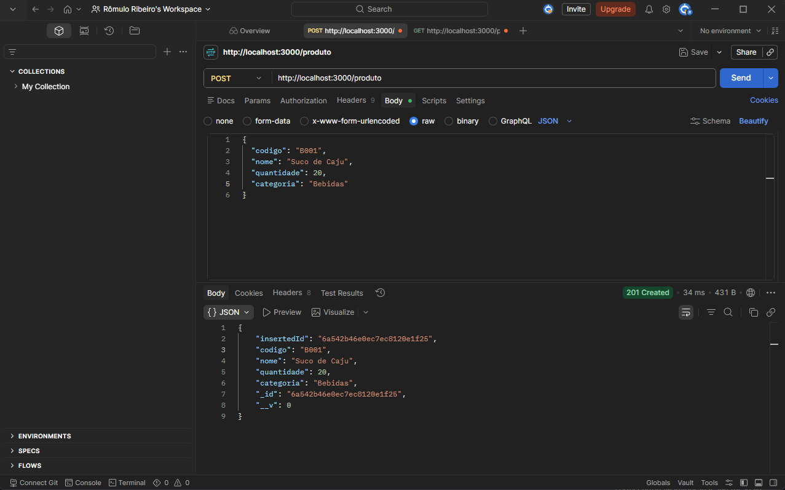
  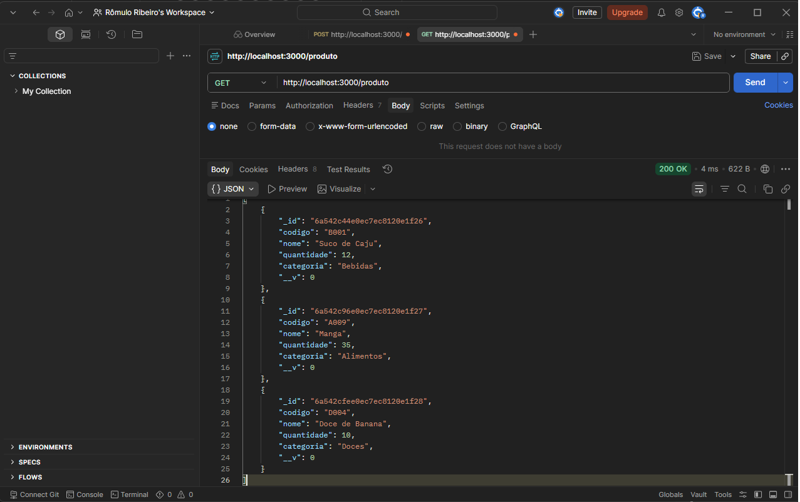
  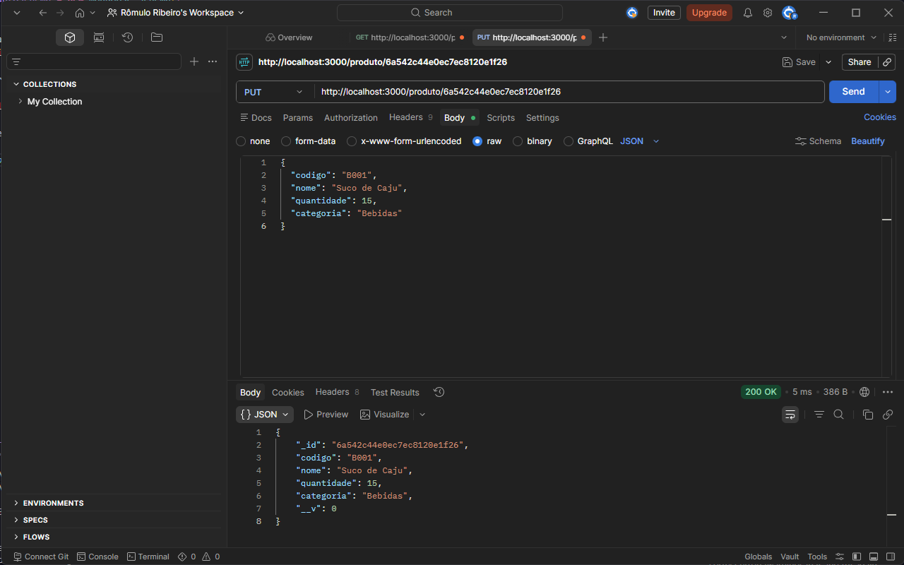
  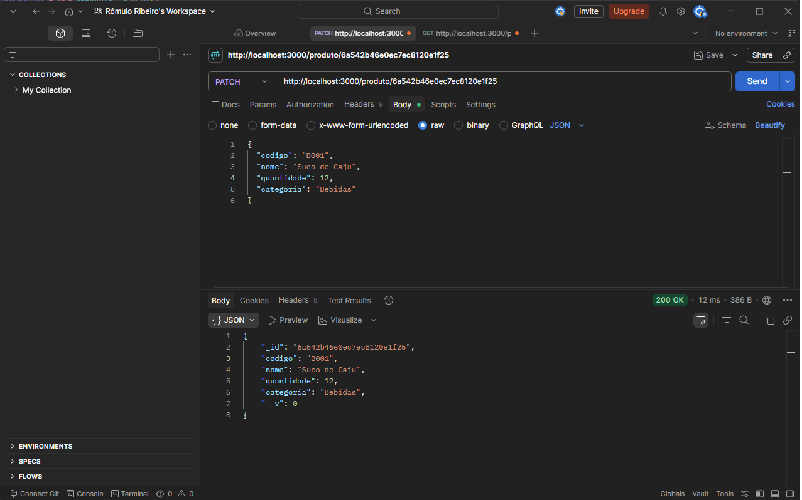
  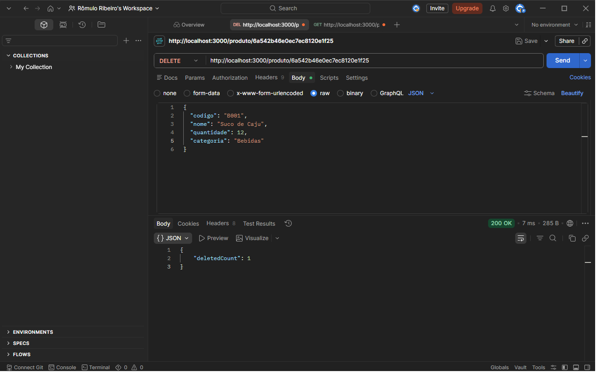
</p>

### Testes unitários (Karma + Jasmine)
Todos os componentes possuem testes unitários configurados, cobrindo injeção de dependência (`HttpClient`, `Router`, `FormBuilder`, `MatDialog`) e elementos customizados (`CUSTOM_ELEMENTS_SCHEMA`).

<p align="center">
  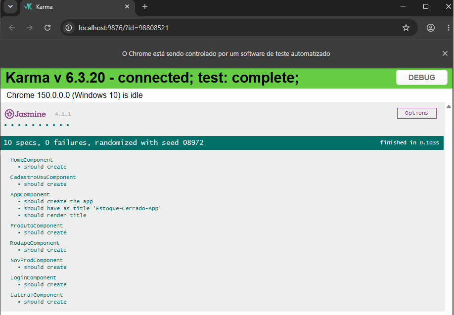
</p>

---

## 🖼️ Telas da aplicação

<p align="center">
  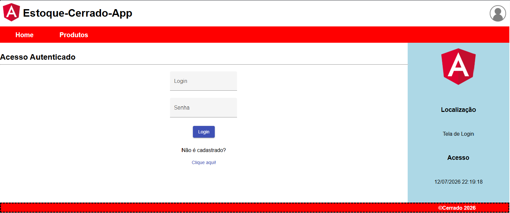
  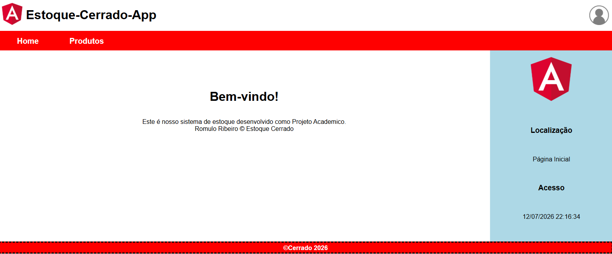
  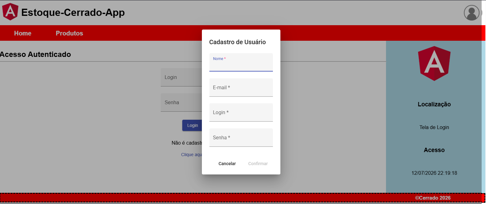
  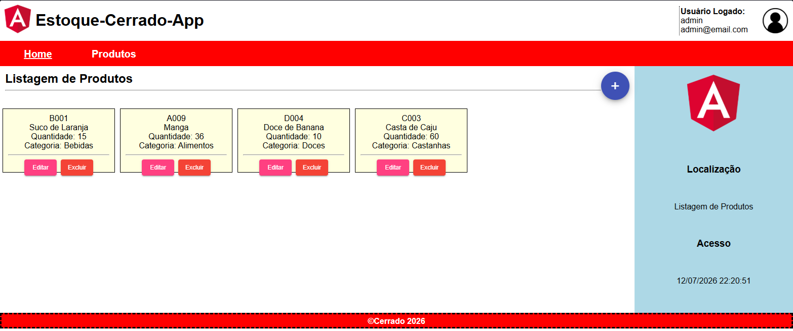
</p>

---

## 🗄️ Banco de dados

Administrado localmente via **MongoDB Compass**:

<p align="center">
  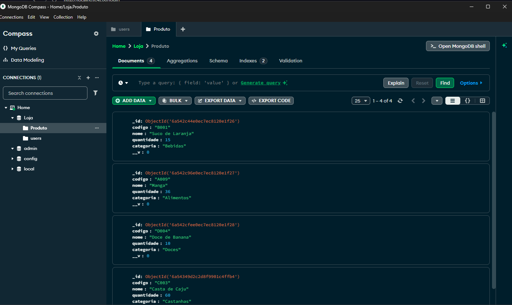
</p>

---

## 📁 Estrutura do projeto

```
PROJETO-ANGULAR14-ESTOQUE/
├── assets/              # imagens usadas neste README
├── backend-estoque/     # API Node.js + Express + Mongoose
│   ├── models/
│   ├── routes/
│   └── server.js
└── front-estoque/       # Aplicação Angular 14
    └── src/
```

---

## ▶️ Como executar o projeto

### Pré-requisitos
- [Node.js](https://nodejs.org/) instalado
- [MongoDB](https://www.mongodb.com/try/download/community) rodando localmente (ou ajustar a string de conexão)
- [Angular CLI](https://angular.io/cli) instalado globalmente: `npm install -g @angular/cli`

### 1. Clonar o repositório
```bash
git clone <https://github.com/Romulorpr/Projeto-Angular14-EstoqueApp.git>
cd PROJETO-ANGULAR14-ESTOQUE
```

### 2. Rodar o backend
```bash
cd backend-estoque
npm install
npm start
```
O servidor sobe em `http://localhost:3000`.

### 3. Rodar o frontend
Em outro terminal:
```bash
cd front-estoque
npm install
ng serve
```
A aplicação abre em `http://localhost:4200`.

### 4. Rodar os testes unitários (opcional)
```bash
cd front-estoque
ng test
```
---

## 👤 Autor

Desenvolvido por **Romulo Ribeiro**.

https://github.com/Romulorpr